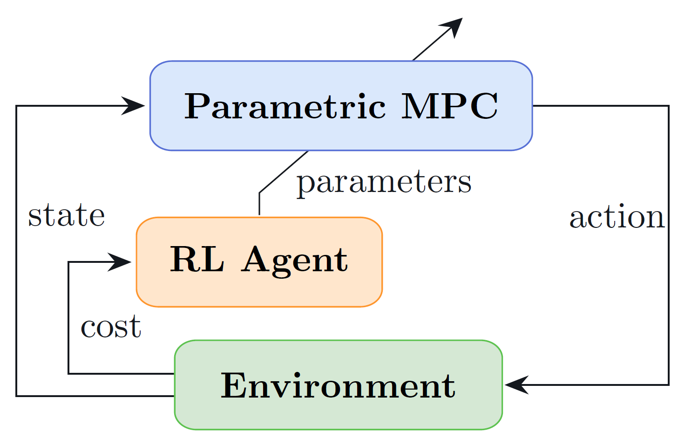
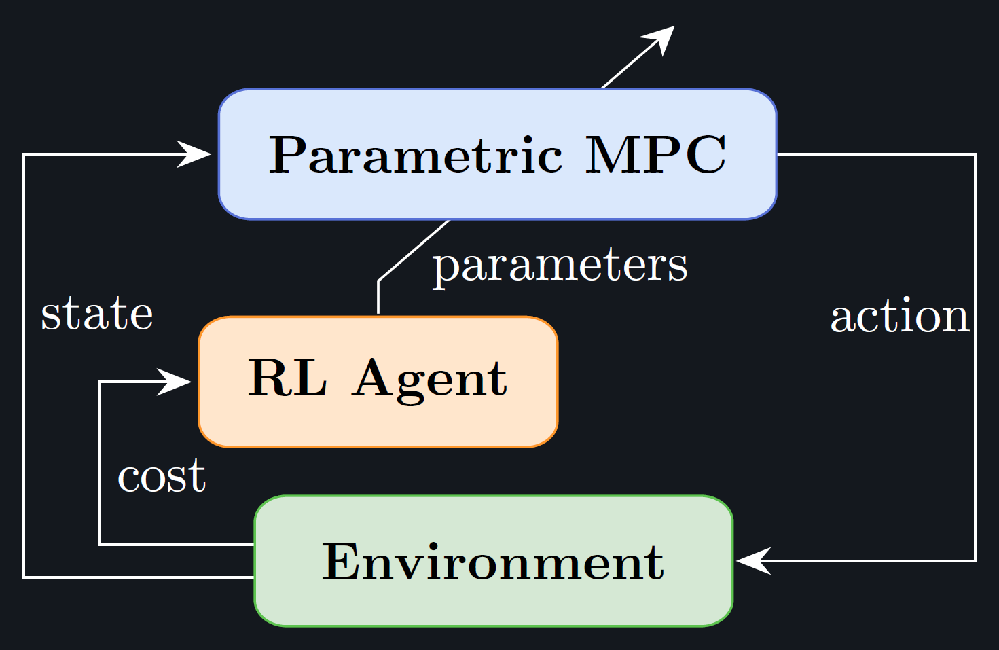

====================================================
Reinforcement Learning with Model Predictive Control
====================================================

.. automodule:: mpcrl

|PyPI version| |Source Code License| |Python 3.9|

|Tests| |Docs| |Downloads| |Maintainability| |Test Coverage| |Code style: black|

------------------
Short introduction
------------------

This framework, also referred to as *RL with/using MPC*, was first proposed in
:cite:`gros_datadriven_2020` and has so far been shown effective in various
applications, with different learning algorithms and more sound theory, e.g.,
:cite:`cai_mpcbased_2021,esfahani_approximate_2021,zanon_safe_2021,gros_learning_2022`.
It merges two powerful control techinques into a single data-driven one

- MPC, a well-known control methodology that exploits a prediction model to predict the
  future behaviour of the environment and compute the optimal action

- and RL, a Machine Learning paradigm that showed many successes in recent years (with
  games such as chess, Go, etc.) and is highly adaptable to unknown and complex-to-model
  environments.

The figure below shows the main idea behind this learning-based control approach. The
MPC controller, parametrized in its objective, predictive model and constraints (or a
subset of these), acts both as policy provider (i.e., providing an action to the
environment, given the current state) and as function approximation for the state and
action value functions (i.e., predicting the expected return following the current
control policy from the given state and state-action pair). Concurrently, an RL
algorithm is employed to tune this parametrization of the MPC in such a way to increase
the controller's performance and achieve an (sub)optimal policy. For this purpose,
different algorithms can be employed, two of the most successful being Q-learning
:cite:`esfahani_approximate_2021` and Deterministic Policy Gradient (DPG)
:cite:`cai_mpcbased_2021`.

   Diagram of the MPC-RL framework.

   Diagram of the MPC-RL framework.

------
Author
------

`Filippo Airaldi <https://www.tudelft.nl/staff/f.airaldi/>`_, PhD Candidate
[f.airaldi@tudelft.nl | filippoairaldi@gmail.com] at
`Delft Center for Systems and Control <https://www.tudelft.nl/en/me/about/departments/delft-center-for-systems-and-control/>`_
in `Delft University of Technology <https://www.tudelft.nl/en/>`_.

Copyright (c) 2024 Filippo Airaldi.

Copyright notice: Technische Universiteit Delft hereby disclaims all copyright interest
in the program “mpcrl” (Reinforcement Learning with Model Predictive Control) written by
the Author(s). Prof. Dr. Ir. Fred van Keulen, Dean of ME.

.. toctree::
   :hidden:

   Module reference <module-reference>
   Changelog <https://github.com/FilippoAiraldi/mpc-reinforcement-learning/releases>

------------------
Indices and tables
------------------

* :ref:`genindex`
* :ref:`modindex`
* :ref:`search`

----------
References
----------

.. bibliography:: references.bib
   :style: plain

.. |PyPI version| image:: https://badge.fury.io/py/mpcrl.svg
   :target: https://badge.fury.io/py/mpcrl
   :alt: PyPI version
.. |Source Code License| image:: https://img.shields.io/badge/license-MIT-blueviolet
   :target: https://github.com/FilippoAiraldi/mpc-reinforcement-learning/blob/main/LICENSE
   :alt: MIT License
.. |Python 3.9| image:: https://img.shields.io/badge/python-%3E=3.9-green.svg
   :alt: Python 3.9
.. |Tests| image:: https://github.com/FilippoAiraldi/mpc-reinforcement-learning/actions/workflows/test-main.yml/badge.svg
   :target: https://github.com/FilippoAiraldi/mpc-reinforcement-learning/actions/workflows/test-main.yml
   :alt: Tests
.. |Docs| image:: https://readthedocs.org/projects/mpc-reinforcement-learning/badge/?version=stable
   :target: https://mpc-reinforcement-learning.readthedocs.io/en/stable/?badge=stable
   :alt: Docs
.. |Downloads| image:: https://static.pepy.tech/badge/mpcrl
   :target: https://www.pepy.tech/projects/mpcrl
   :alt: Downloads
.. |Maintainability| image:: https://api.codeclimate.com/v1/badges/9a46f52603d29c684c48/maintainability
   :target: https://codeclimate.com/github/FilippoAiraldi/mpc-reinforcement-learning/maintainability
   :alt: Maintainability
.. |Test Coverage| image:: https://api.codeclimate.com/v1/badges/9a46f52603d29c684c48/test_coverage
   :target: https://codeclimate.com/github/FilippoAiraldi/mpc-reinforcement-learning/test_coverage
   :alt: Test Coverage
.. |Code style: black| image:: https://img.shields.io/badge/code%20style-black-000000.svg
   :target: https://github.com/psf/black
   :alt: blacks
